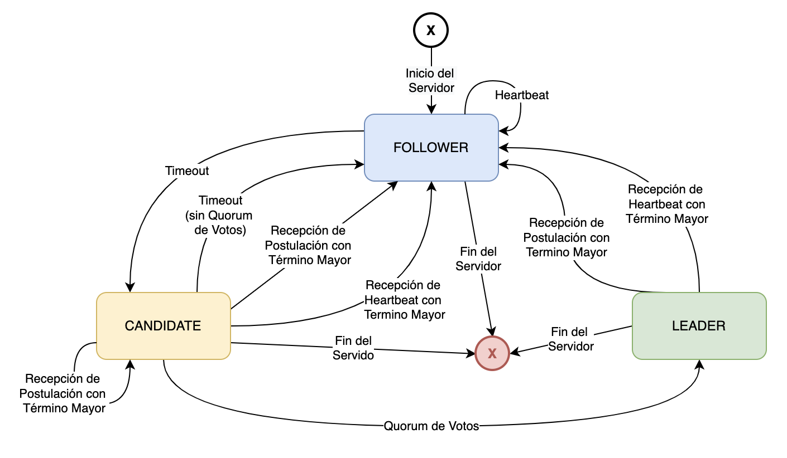
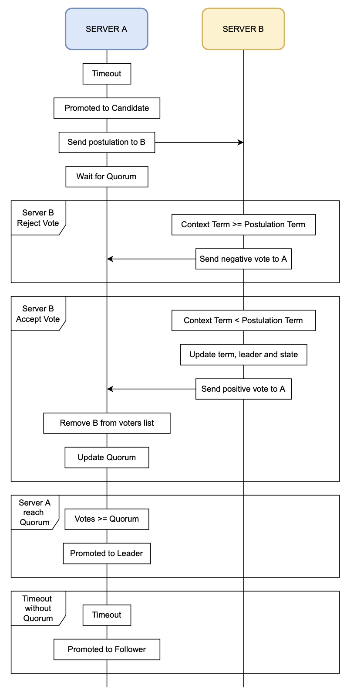
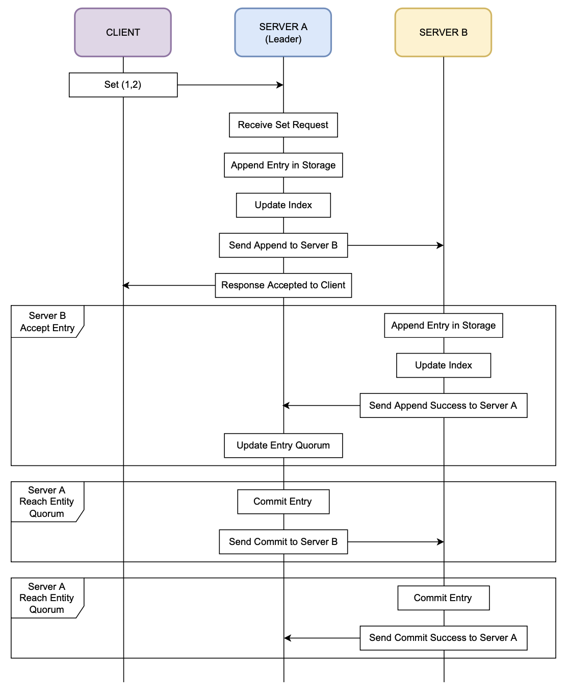
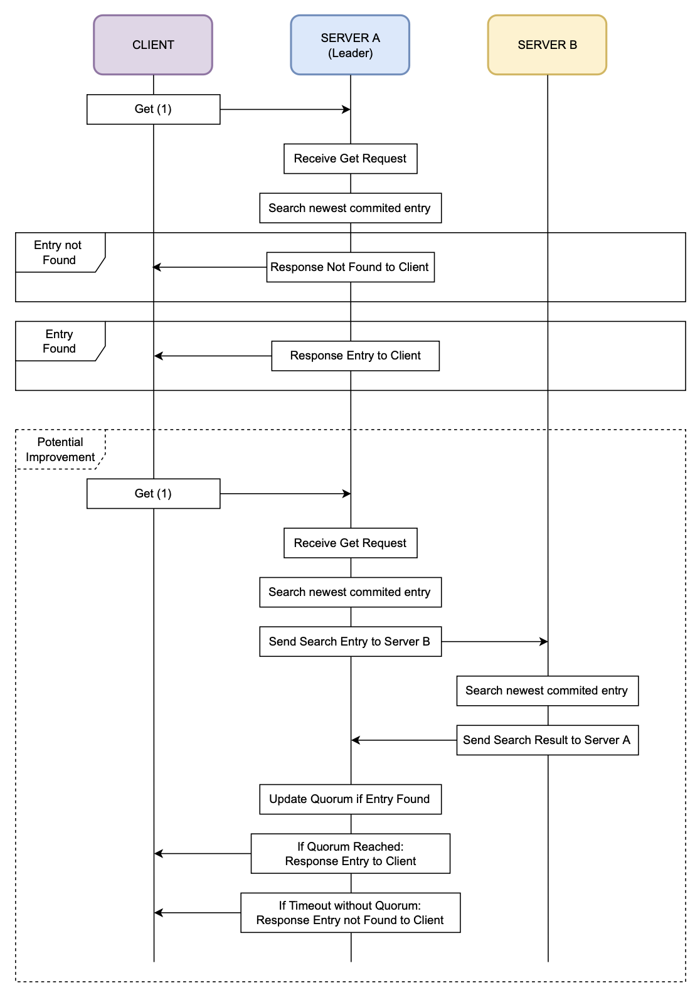
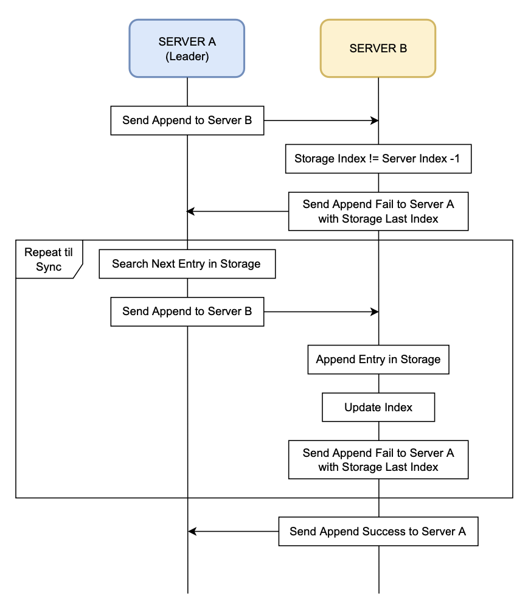

# Implementación del Protocolo Raft

## Consideraciones Generales
El algoritmo Raft fue implementado en Java 8. El envío de mensajes entre servidores y clientes, se utiliza el protocolo UDP donde cada mensaje se envía de forma independiente en el socket, pero con la consideración que el aplicativo (tanto cliente como servidor) queda a la espera de una respuesta para la mayoría de los mensajes.

Cada servidor posee un contexto con los siguientes datos:
- `port` es el puerto en donde escucha el servidor.
- `address` es la dirección del servidor (por lo que siempre será `localhost`).
- `serverSocket` es el socket configurado para el servidor (en el puerto indicado previamente).
- `timeout` es el máximo de tiempo que se mantiene como seguidor (en caso de no recibir heartbeat de su líder) o como candidato (en caso de no llegar al quorum de votos positivos).
- `allHosts` es un listado de todos los servidores del sistema (armada a partir del archivo `allServers.txt` que se menciona más adelante).
- `leader` es el servidor líder del servidor actual (en caso de que el servidor actual sea líder, este campo no se utilizará).
- `term` es el término actual del servidor.
- `storageIndex` es el índice actual del almacenamiento del servidor.
- `storageFile` es el nombre del archivo de almacenamiento del servidor.
- `logFile` es el nombre del archivo de log del servidor.

---

## Máquina de Estados
Tal como se describe en el algoritmo Raft, cada servidor posee una máquina de estados con tres posibles valores (`Follower`, `Candidate` y `Leader`), entre los cuales el mismo puede ir variando como se ve en el siguiente gráfico:

---

## Persistencia y Logs
Además cada servidor cuenta con dos archivos, uno de registro como indica el protocolo donde quedará el historial de valores consensuados (y no consensuados) mientras dure la ejecución del servidor (cuando el servidor se cae y luego se recupera, su registro se reinicializa sincronizándose con el del líder actual) y uno de logs que se agrega a los fines prácticos de poder realizar un análisis de los mensajes intercambiados entre servidores.

Se implementó también un cliente el cual se conecta directamente a uno de los servidores para generar la interacción esperada, y el cual también genera un archivo de log (pero no de registro).

Todos los archivos generados se persisten dentro del directorio `/textFiles`, en `/storage` y `/logs` según corresponda, con el nombre formado por la fecha y hora en la cual se inicializa el servidor con el formato `YYYYMMddHHmm-` y el puerto en el que está escuchando el servidor (por ejemplo `202202192008-5678`) y la extensión `.json` para los registros (para poder procesarlos de manera sencilla durante la ejecución del servidor) y `.txt` para los logs (para sencillamente leerlos en un editor de texto).

Dentro del directorio `/textFiles` también se encuentra un archivo estático llamado `allServers.txt` el cual contiene la lista de todos los servidores disponibles (esto es para mantener una lista de host para enviar mensajes de tipo broadcast, ya que la misma no es dinámica). Antes de la ejecución de los servidores se debe configurar este archivo según el escenario deseado.

---

## Selección de Líder
Se espera que el servidor líder envíe heartbeats periódicos para mantener su rol sobre el resto de los servidores. En caso de que esto no ocurra; ya sea porque existía un servidor líder que se cayó o porque directamente no había un servidor líder (inicio del sistema) comienza el proceso de postulación.

El proceso comienza cuando un servidor da timeout, lo que lo promueve automáticamente a candidato, lo que implica que aumente su término en 1 y envíe solicitudes de votos a los demás servidores. El servidor se mantendrá en el rol de candidato hasta obtener quorum de votos positivos de sus seguidores (caso que lo promueve a líder) o bien un nuevo timeout sin llegar al quorum.

En el siguiente diagrama se aprecian las interacciones entre el servidor candidato y uno de los servidores seguidores durante el proceso de postulación y elección de líder.

---

## Interacción Cliente-Servidor
Como se mencionó previamente el desarrollo incluye un cliente el cual puede conectarse a un servidor local o remoto simplemente ejecutándose con dirección y puerto del servidor; y ejecutar dos comandos: `Set` y `Get`. Los mismos se utilizan para enviar un par (id, value) para persistir en el sistema y para obtener el valor para un id persistido previamente, respectivamente.

El comando `Set` dispara un conjunto de interacciones entre el servidor líder y sus seguidores con el fin de persistir el nuevo dato mediante consenso. Para ello el líder persiste el nuevo elemento en su almacenamiento interno, envía una solicitud a cada uno de sus seguidores para que realicen el mismo procedimiento y finalmente responde al cliente indicando que se aceptó su solicitud (esto no indica que la misma se haya persistido exitosamente; ya que si no se logra el consenso el cliente puede consultar por dicho valor, pero el servidor no tendrá respuesta).

Cuando cada seguidor recibe la solicitud para agregar el elemento a su almacenamiento realiza un chequeo de índice y si el mismo es correcto procede a persistir el dato sin confirmar y responder al líder con un `append_success` (en caso de que el almacenamiento no este sincronizado se seguirán los pasos descritos en `Sincronización de Datos entre Servidores`).

Por cada `append_success` que recibe el líder, este aumenta el quorum del elemento, y en caso de llegar al valor esperado confirma el elemento y envía a cada uno de sus seguidores una nueva solicitud para que realicen el mismo procedimiento. Cada seguidor que recibe dicha solicitud confirma el elemento y responde con un `commit_success`. En este punto se logra el consenso y el elemento queda disponible para futuras consultas.

Por otro lado, el comando `get` directamente es una interacción entre el cliente y el servidor al cual está conectado. En este caso el servidor busca el id consultado por el cliente en su almacenamiento interno, teniendo en cuenta que el elemento debe ser la entrada confirmada más nueva. En caso de encontrar un elemento que cumpla estas condiciones, lo agrega a la respuesta y envía la misma al cliente. Caso contrario envía una respuesta indicando que no encontró el elemento solicitado.

Una potencial mejora que no está incluida en este desarrollo es implementar una lógica de consenso análoga a la de `Set` para `Get`. Para ello la idea sería que al momento de recibir un `get` realiza la misma búsqueda de la entrada confirmada más nueva, pero además propaga la misma consulta al resto de los servidores. Con cada respuesta recibida, aumenta el quorum de la entrada encontrada y en caso de llegar al valor esperado agrega el elemento a la respuesta y envía la misma al cliente. Caso contrario de no lograr quorum luego de un período acotado de tiempo, enviará una respuesta indicando que no encontró el elemento solicitado.

---

## Sincronización de Datos entre Servidores
Como se mencionó previamente, ante una solicitud del servidor líder a un seguidor para agregar un nuevo elemento a su almacenamiento, se puede detectar una diferencia en los índices de los mismos, lo que inicia un protocolo de sincronización. Cabe aclarar que la inconsistencia también se puede detectar en la recepción del heartbeat por parte del seguidor e iniciar el protocolo.

Entonces, cuando un seguidor detecta una inconsistencia entre su almacenamiento y el de su líder, envía una solicitud de tipo `append_fail` o `inconsistent_log` (dependiendo del caso) a su líder con su índice. Ante esta situación, el líder busca el siguiente elemento en su almacenamiento y manda la solicitud de agregarlo únicamente al servidor con inconsistencias. Dicho servidor, agrega el elemento a su almacenamiento (si el mismo ya estaba confirmado en el líder, también lo marca como confirmado), actualiza su índice y repite el procedimiento hasta que el mismo quede sincronizado con el del líder. Cuando esto ocurre envía una solicitud de tipo `append_success` para finalizar la sincronización.

